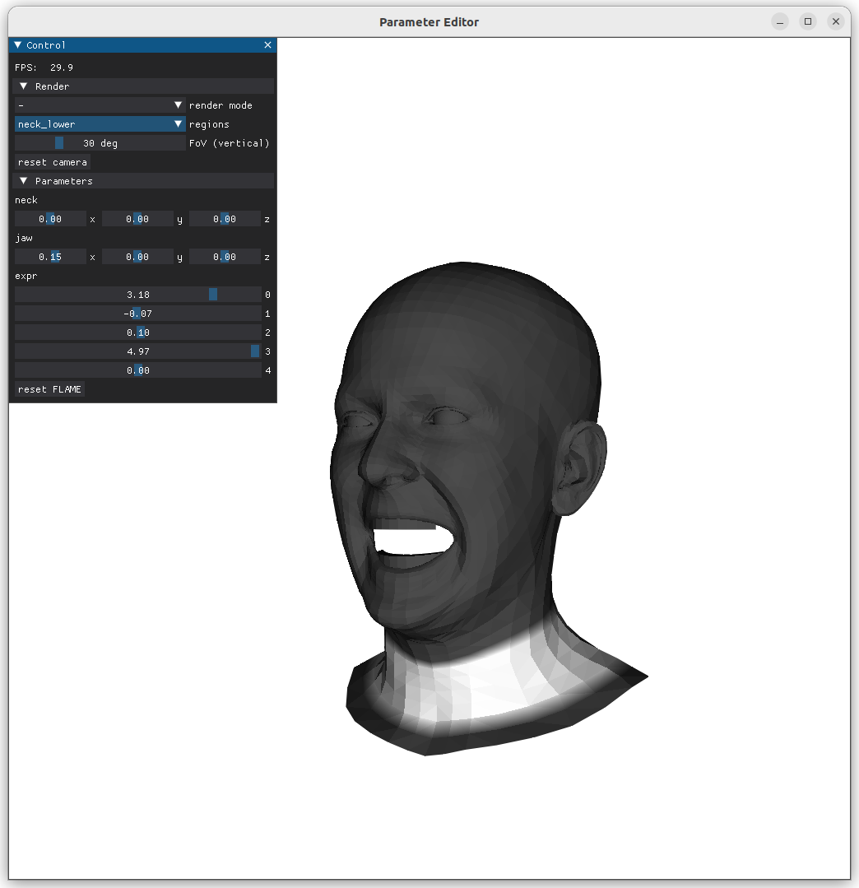
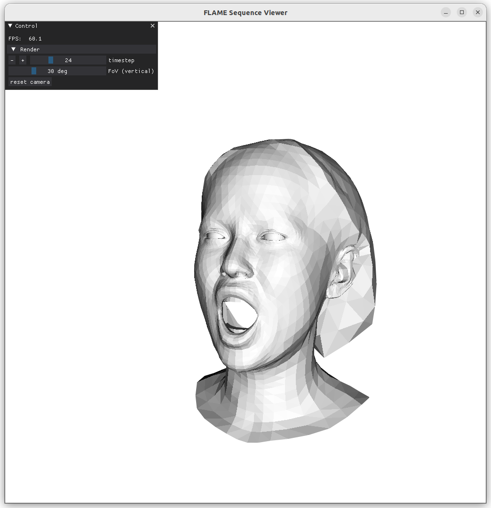

# VHAP: Versatile Head Alignment with Adaptive Appearance Priors

<div align="center"> 
  
</div>

## TL;DR

- A photometric optimization pipeline based on differentiable mesh rasterization, applied to human head alignment.
- A perturbation mechanism that implicitly extract and inject regional appearance priors adaptively during rendering, enabling alignment of regions purely based on their appearance consistency, such as the hair, ears, neck, and shoulders, where no pre-defined landmarks are available.
- The exported tracking results can be directly used to create you own [GaussianAvatars](https://github.com/ShenhanQian/GaussianAvatars).

## License

This work is made available under [CC-BY-NC-SA-4.0](./LICENSE). The repository is derived from the [multi-view head tracker of GaussianAvatars](https://github.com/ShenhanQian/GaussianAvatars/tree/main/reference_tracker), which is subjected to the following statements:

> Toyota Motor Europe NV/SA and its affiliated companies retain all intellectual property and proprietary rights in and to this software and related documentation. Any commercial use, reproduction, disclosure or distribution of this software and related documentation without an express license agreement from Toyota Motor Europe NV/SA is strictly prohibited.

On top of the original repository, we add support to monocular videos and provide a complete set of scripts from video preprocessing to result export for NeRF/3DGS-style applications.

## Setup

```shell
git clone git@github.com:ShenhanQian/VHAP.git
cd VHAP

conda create --name VHAP -y python=3.10
conda activate VHAP

# Install CUDA and ninja for compilation
conda install -c "nvidia/label/cuda-12.1.1" cuda-toolkit ninja cmake  # use the right CUDA version
ln -s "$CONDA_PREFIX/lib" "$CONDA_PREFIX/lib64"  # to avoid error "/usr/bin/ld: cannot find -lcudart"
conda env config vars set CUDA_HOME=$CONDA_PREFIX  # for compilation

# Install PyTorch (make sure that the CUDA version matches with "Step 1")
pip install torch torchvision --index-url https://download.pytorch.org/whl/cu121
# or
conda install pytorch torchvision pytorch-cuda=12.1 -c pytorch -c nvidia
# make sure torch.cuda.is_available() returns True

pip install -e .
```

> [!NOTE]
> - We use an adjusted version of [nvdiffrast](https://github.com/ShenhanQian/nvdiffrast/tree/backface-culling) for backface-culling. If you have other versions installed before, you can reinstall as follows:
>    ```shell
>    pip install nvdiffrast@git+https://github.com/ShenhanQian/nvdiffrast@backface-culling --force-reinstall
>    rm -r ~/.cache/torch_extensions/*/nvdiffrast*
>    ```
> - We use [STAR](https://github.com/ShenhanQian/STAR/) for landmark detection by default. Alterntively, [face-alignment](https://github.com/1adrianb/face-alignment) is faster but less accurate.

## Download

### FLAME

Our code relies on FLAME. Please download assets from the [official website](https://flame.is.tue.mpg.de/download.php) and store them in the paths below:

- FLAME 2023 (versions w/ jaw rotation) -> `asset/flame/flame2023.pkl`
- FLAME Vertex Masks -> `asset/flame/FLAME_masks.pkl`

> [!NOTE]
> It is possible to use FLAME 2020 by download to `asset/flame/generic_model.pkl`. The `FLAME_MODEL_PATH` in `flame.py` needs to be updated accordingly.

### Video Data

#### Multiview

To get access to [NeRSemble](https://tobias-kirschstein.github.io/nersemble/) dataset, please request via the [Google Form](https://forms.gle/rYRoGNh2ed51TDWX9). The directory structure is expected to be like [this](https://github.com/ShenhanQian/VHAP/blob/c9ea660c6c6719110eca5ffdaf9029a2596cc5ca/vhap/data/nersemble_dataset.py#L32-L54).

#### Monocular

We use monocular video sequences following [INSTA](https://zielon.github.io/insta/). You can download raw videos from [LRZ](https://syncandshare.lrz.de/getlink/fiJE46wKrG6oTVZ16CUmMr/VHAP).

## Usage

### [For Monocular Videos](doc/monocular.md)

<div align="center"> 
  
</div>

### [For NeRSemble Dataset](doc/nersemble.md)

<div align="center"> 
  
</div>

## Discussions

Photometric alignment is versatile but sometimes sensitive.

**Texture map regularization**: Our method relies on a total-variation regularization on the texture map. Its loss weight is by default `1e4` for a monocualr video and `1e5` for the NeRSemble dataset (16 views). For you own multi-view dataset with fewer views, you should lower the regularization by passing `--w.reg_tex_tv 1e4` or 3e4. Otherwise, you may encounter corrupted shapes and blurry textures similar to https://github.com/ShenhanQian/VHAP/issues/10#issue-2558743737 and https://github.com/ShenhanQian/VHAP/issues/6#issue-2524833245.

**Color affinity:** If the color of a point on the foreground contour is too close to the background, the [`static_offset`](https://github.com/ShenhanQian/VHAP/blob/64c18060e7aad104bf05a2c06aab7818f54af6bd/vhap/model/flame.py#L583) can go wild. You may try a different background color by `--data.background_color white` or `--data.background_color black`. You can also disable `static_offset` by `--model.no_use_static_offset`.

**Occlussion:** When the neck is occluded by collars, the photometric gradients may squeeze and stretch the neck into unnatural shapes. Usually, this problem can be relieved by disabling photometric alignment in certain regions. We hard-coded the occlusion status for some subjects in the NeRSemble dataset with the [`occluded_table`](https://github.com/ShenhanQian/VHAP/blob/51a2792bd3ad3f920d9cd8f1b107a56b92349520/vhap/config/nersemble.py#L71). You can extend the table or temporally change it by, e.g., `--model.occluded neck_lower boundary`.

**Limited degree of freedom:** Another limitation comes from the FLAME model. FLAME is great since it covers the whole head and neck. However, there is only one joint for the neck, between the neck and the head. This means the lower part of the neck cannot move relative to the torse. This limits the model's ability to capture large movement of the head. For example, it's very hard to achieve good alignment of the lower neck and the head at the same time for the *EXP-1-head* sequence in NeRSemble dataset because of the aforementioned lack of degree of freedom.

**You are welcomed to report more failure cases and help us improve the tracker.**

## Interactive Viewers

Our method relies on vertex masks defined on FLAME. We add custom masks to enrich the original ones. You can play with `regions` in our FLAME Editor to see how each mask look like .

```shell
python vhap/flame_editor.py
```

We also provide a FLAME viewer for you to interact with a tracked sequence.

```shell
python vhap/flame_viewer.py \
--param_path output/nersemble/074_EMO-1_v16_DS4_wBg_staticOffset/2024-09-09_15-49-02/tracked_flame_params_30.npz \
```

Optional, you can enable colored rendering by specifying a texture image with `--tex_path`.

For both viewers, you can switch to flat shading with `--no-shade-smooth`.

<div align="center"> 
  
  
</div>

## Cite

Please kindly cite our repository and preceding paper if you find our software or algorithm useful for your research.

```bibtex
@misc{qian2024versatile,
  title   = "VHAP: Versatile Head Alignment with Adaptive Appearance Priors",
  author  = "Qian, Shenhan",
  year    = "2024",
  month   = "September",
  url     = "https://github.com/ShenhanQian/VHAP"
}
```

```bibtex
@inproceedings{qian2024gaussianavatars,
  title={Gaussianavatars: Photorealistic head avatars with rigged 3d gaussians},
  author={Qian, Shenhan and Kirschstein, Tobias and Schoneveld, Liam and Davoli, Davide and Giebenhain, Simon and Nie{\ss}ner, Matthias},
  booktitle={Proceedings of the IEEE/CVF Conference on Computer Vision and Pattern Recognition},
  pages={20299--20309},
  year={2024}
}
```
