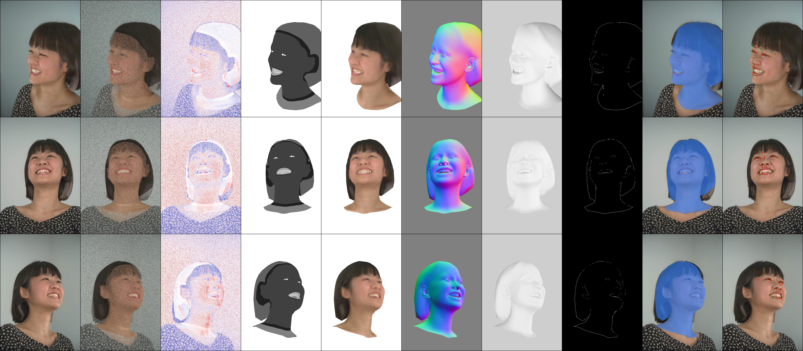

## For NeRSemble Dataset

<div align="center"> 
  
</div>

### 1. Preprocess

This step extracts frames from video(s), then run foreground matting for each frame, which requires GPU.

```shell
SUBJECT="074"
SEQUENCE="EMO-1"

python vhap/preprocess_video.py \
--input data/nersemble/${SUBJECT}/${SEQUENCE} \
--downsample_scales 2 4 \
--matting_method background_matting_v2
```

- `--downsample_scales 2 4`: Generate downsampled versions of the images in scale 2 and 4.
- `--matting_method background_matting_v2`: Use BackGroundMatingV2 due to availability of background images.

After preprocessing, you can inspect images, masks, and landmarks with our [NeRSemble Data Viewer](https://github.com/ShenhanQian/nersemble-data-viewer).

### 2. Align and track faces

This step automatically detects facial landmarks if absent, then begin FLAME tracking. We initialize shape and appearance parameters on the first frame, then do a sequential tracking of following frames. After the sequence tracking, we conduct 30 epochs of global tracking, which optimize all the parameters on a random frame in each iteration.

```shell
SUBJECT="074"
SEQUENCE="EMO-1"
TRACK_OUTPUT_FOLDER="output/nersemble/${SUBJECT}_${SEQUENCE}_v16_DS4_wBg_staticOffset"

python vhap/track_nersemble.py --data.root_folder "data/nersemble" \
--exp.output_folder $TRACK_OUTPUT_FOLDER \
--data.subject $SUBJECT --data.sequence $SEQUENCE \
--data.n_downsample_rgb 4
```

Optional arguments

- `--model.no_use_static_offset`: disable static offset for FLAME (very stable, but less aligned facial geometry)

  > Disabling static offset will automatically triggers `--model.occluded hair`, which is crucial to prevent the head from growing too larger to align with the top of hair.

- `--exp.no_photometric`: track only with landmark (very fast, but coarse)

### 3. Export tracking results into a NeRF-style dataset

Given the tracked FLAME parameters from the above step, you can export the results to form a NeRF/3DGS style sequence, consisting of image folders and a `transforms.json`.

```shell
SUBJECT="074"
SEQUENCE="EMO-1"
TRACK_OUTPUT_FOLDER="output/nersemble/${SUBJECT}_${SEQUENCE}_v16_DS4_wBg_staticOffset"
EXPORT_OUTPUT_FOLDER="export/nersemble/${SUBJECT}_${SEQUENCE}_v16_DS4_whiteBg_staticOffset_maskBelowLine"

python vhap/export_as_nerf_dataset.py \
--src_folder ${TRACK_OUTPUT_FOLDER} \
--tgt_folder ${EXPORT_OUTPUT_FOLDER} --background-color white
```

### 4. Combine exported sequences of the same person as a union dataset

```shell
SUBJECT="074"

python vhap/combine_nerf_datasets.py \
--src_folders \
  export/nersemble/${SUBJECT}_EMO-1_v16_DS4_whiteBg_staticOffset_maskBelowLine \
  export/nersemble/${SUBJECT}_EMO-2_v16_DS4_whiteBg_staticOffset_maskBelowLine \
  export/nersemble/${SUBJECT}_EMO-3_v16_DS4_whiteBg_staticOffset_maskBelowLine \
  export/nersemble/${SUBJECT}_EMO-4_v16_DS4_whiteBg_staticOffset_maskBelowLine \
  export/nersemble/${SUBJECT}_EXP-2_v16_DS4_whiteBg_staticOffset_maskBelowLine \
  export/nersemble/${SUBJECT}_EXP-3_v16_DS4_whiteBg_staticOffset_maskBelowLine \
  export/nersemble/${SUBJECT}_EXP-4_v16_DS4_whiteBg_staticOffset_maskBelowLine \
  export/nersemble/${SUBJECT}_EXP-5_v16_DS4_whiteBg_staticOffset_maskBelowLine \
  export/nersemble/${SUBJECT}_EXP-8_v16_DS4_whiteBg_staticOffset_maskBelowLine \
  export/nersemble/${SUBJECT}_EXP-9_v16_DS4_whiteBg_staticOffset_maskBelowLine \
--tgt_folder \
  export/nersemble/UNION10_${SUBJECT}_EMO1234EXP234589_v16_DS4_whiteBg_staticOffset_maskBelowLine
```

> Note: the `tgt_folder` must be in the same parent folder as `src_folders` because the union dataset read from the original image files by relative paths.